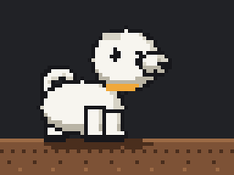

# research-council



A Claude Code plugin that researches a hard problem before anyone codes it. An agentic
research harness: frozen goal, evidence-backed claims, competing hypotheses, plain-English
findings.

## Install

```
git clone https://github.com/abhisheksharma001/research-council
claude --plugin-dir ./research-council
```

Then, inside Claude Code: `/research-council <your problem>`. Python 3.11+, no pip installs.

## Why

Coding agents start building on the first explanation they hear. This plugin makes the
model argue with itself first: at least two credible explanations, a budget you set, every
claim tied to fetched evidence, and a report that says how sure it is and what it could not
find. Small tasks are refused. The model never promotes its own procedures into the skill
library; a script with a hard gate does.

## Built for frontier models

The harness exists to squeeze the most out of an AGI-class model, not to babysit a weak one.
A strong model gets more room: more competing explanations, deeper evidence chains, and the
harder problems that a coding agent would otherwise skip past. Every guard is a script, so the
model spends its capability on the research and none of it on pretending to be careful.

Works best with the most capable model available in Claude Code; developed and self-run on
Claude Fable 5.1. Weaker models still run the loop, they just find less.

## How it works

Give it a problem with more than one credible explanation. It freezes a goal and a budget you set,
investigates with separate roles, records every claim against fetched evidence, follows an explicit
curiosity protocol when something unexpected shows up, and writes two files into
`AGI_Research/runs/<goal_id>/` in the project:

- `FINDINGS.md` — what was found, how sure, what failed, what is still unknown. Plain English.
- `HANDOFF.md` — a brief a coding agent can build from, with an acceptance sentence.

Validated procedures go into a versioned skill library only after a controller runs every retained
task contract. The model never promotes.

Status: S-1..S-16 and S-18 of 20 merged, plus S-24..S-27; self-improve loop (`skills/self-improve/`) S-21..S-23 merged, first self-run 2026-09-09 (`docs/runs/2026-09-09-self-run.md`); first real run 2026-09-09 (`docs/runs/2026-09-09-first-run.md`). See `docs/spec-v1.md`.

```
python3 scripts/validate_skill.py skills/research-council   # OK
python3 -m unittest discover -s tests -v
```

Portable: `skills/research-council/SKILL.md` follows the [Agent Skills spec](https://agentskills.io/specification).
Licence: MIT (`LICENSE`). Mascot: `assets/mascot/` (original pixel design, drawn from code).
Research behind the design: `~/AGI_Research/`.
